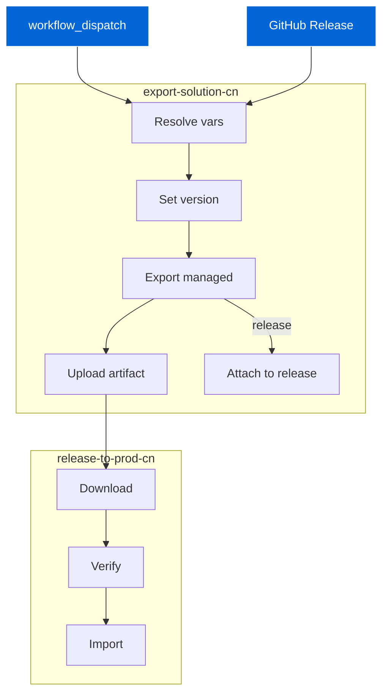
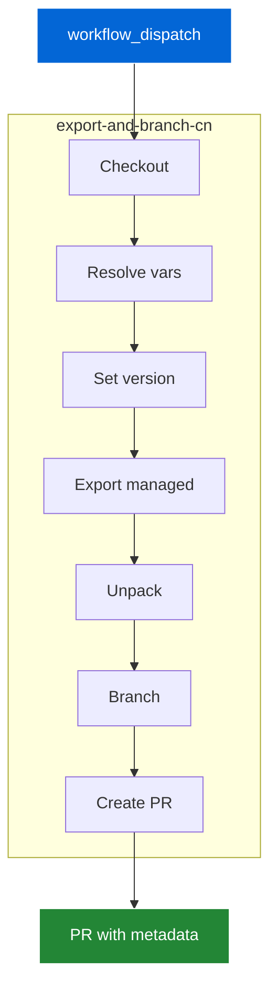
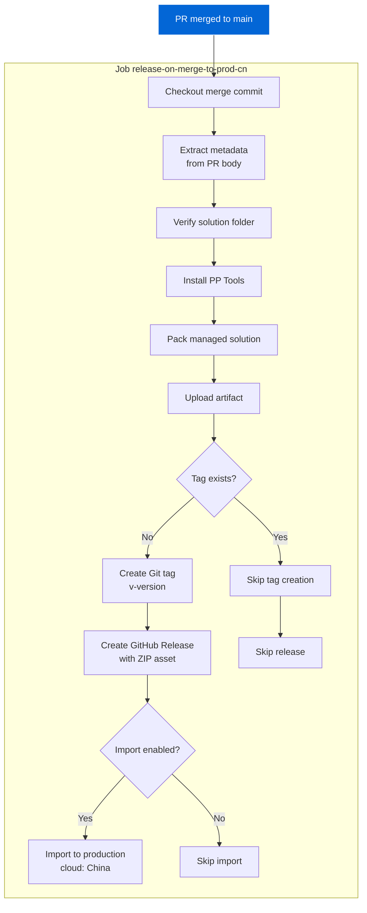

# philipspoc

Power Platform solution CI/CD workflows for China (Mooncake) cloud.

## release-all-in-one-cn

Exports a managed solution from dev and imports to production in China cloud.

### Flow Diagram



### Configuration

**Triggers**: `workflow_dispatch` (manual) | `release.published` (auto)

**Inputs**: 
- `solution_name`: default `HealthcareSystemCN`
- `solution_version`: default `v1.0.0.0` (v-prefix auto-stripped)

**Secrets**: `POWERPLATFORM_URL`, `CLIENT_ID`, `CLIENT_SECRET`, `TENANT_ID`

**Key Settings**: 
- Cloud: China
- Solution type: Managed
- Force overwrite: Yes

### Usage

**Manual**: Actions → Run workflow → Enter name/version

**Release**: Create tag `v1.2.3.4` → Publish release → Auto-deploys

**Output**: Artifact `managedSolutions` with solution ZIP

---

## export-and-branch-solution-cn

Exports solution from dev, unpacks it, and creates PR with metadata.

### Flow Diagram



### Configuration

**Trigger**: `workflow_dispatch` (manual)

**Inputs**: Same as release-all-in-one-cn

**Branch**: `<SolutionName>-<RunNumber>`

**PR Metadata**:
```json
<!--POWER_SOLUTION_METADATA_START-->
{
  "solution": "HealthcareSystemCN",
  "version": "1.0.0.0",
  "managed": true,
  "run_id": "12345",
  "run_number": "42",
  "exported_at": "2024-01-01T12:00:00Z"
}
<!--POWER_SOLUTION_METADATA_END-->
```

### Usage

Actions → Run workflow → Creates branch → Opens PR to main

**Output**: PR with unpacked solution in `solutions/<SolutionName>/`

---

## release-on-merge-cn

The file `.github/workflows/release-on-merge-cn.yml` automates releasing a Power Platform solution to production when a PR is merged to main, including packing the solution, creating a GitHub release, and importing to the China (Mooncake) production environment.

### Mermaid Flow



### Trigger Modes
- Automatic: When a pull request is merged to main branch
- Manual: workflow_dispatch for testing or manual runs

### Variable Resolution
- **Metadata extraction**: Parses PR body for embedded JSON metadata block between `<!--POWER_SOLUTION_METADATA_START-->` and `<!--POWER_SOLUTION_METADATA_END-->`
- **Defaults**:
  - solution: HealthcareSystemCN (if not in metadata)
  - version: 1.0.0.0 (if invalid or missing)
- **Folders**:
  - SOURCE_FOLDER: solutions
  - RELEASE_FOLDER: out/release
- **Version validation**: Must match semantic version pattern `X.X.X.X`
- **Import control**: IMPORT_ENABLED environment variable (true/false)

### Job: release-on-merge-to-prod-cn
1. **Checkout**: Fetch the merge commit with full history
2. **Extract metadata**: Parse PR body for solution name and version from metadata block
3. **Verify solution**: Check that solution folder exists and contains files
4. **Prepare folders**: Create release directory structure
5. **Install PP Tools**: Install Microsoft Power Platform actions
6. **Pack solution**: Create managed solution ZIP from source files
7. **Upload artifact**: Store ZIP as GitHub Actions artifact
8. **Create tag**: If tag `v<version>` doesn't exist, create and push it
9. **Create release**: If tag was created, publish GitHub release with ZIP attachment
10. **Import to production**: If enabled and tag created, deploy to China production environment

### Metadata Extraction
The workflow reads metadata from the PR body's embedded block:
```json
{
  "solution": "HealthcareSystemCN",
  "version": "1.0.0.0",
  "managed": true,
  "run_id": "12345",
  "run_number": "42",
  "exported_at": "2024-01-01T12:00:00.000Z"
}
```
Only `solution` and `version` fields are used; others are informational.

### Secrets Used
- POWERPLATFORM_URL: Production environment URL
- CLIENT_ID: Service principal application ID
- CLIENT_SECRET: Service principal secret
- TENANT_ID: Azure tenant ID
- GITHUB_TOKEN: Automatically provided for release operations

### Notable Flags
- cloud: China ensures correct sovereign cloud endpoints
- force-overwrite: true replaces existing solution in production
- publish-changes: true publishes all customizations after import
- IMPORT_ENABLED: Safety switch to control production deployment

### Concurrency Control
- Group: `release-main`
- Strategy: `cancel-in-progress: false` (ensures releases complete)

### Usage Examples
Automatic flow (recommended):
1. Create PR using `export-and-branch-solution-cn` workflow
2. Review and merge PR to main
3. Workflow automatically:
   - Packs the merged solution
   - Creates version tag (e.g., v1.2.3.4)
   - Publishes GitHub release with ZIP
   - Imports to production (if enabled)

Manual dispatch:
1. Go to Actions -> release-on-merge-cn -> Run workflow
2. Select branch (typically main)
3. Useful for re-running failed deployments

### Outputs
- **Artifact**: managedSolutions containing packed ZIP
- **Git Tag**: `v<version>` pointing to merge commit
- **GitHub Release**: Named `<SolutionName> v<Version>` with:
  - Automated description referencing merged PR
  - Attached managed solution ZIP file
- **Production deployment**: Solution imported to China cloud environment

### Safety Features
- Version validation with fallback to default
- Solution folder verification before packing
- Duplicate tag detection to prevent overwrites
- Optional import gate via IMPORT_ENABLED variable
- Concurrency control to prevent parallel releases

### Permissions Required
- contents: write (for tags and releases)
- pull-requests: read (to access PR metadata)

## Issues
### Plugin bootstrap
Currently, a plugin has to be register from `Use the Plug-in Registration tool`, a GUI tool which could not be integrated into pipeline.

That means to bootstrap the plugin, you need to manually register it using the tool. Further automation can be done by using `pac plugin push`

https://learn.microsoft.com/en-us/power-platform/developer/howto/cli-create-package
https://dotnetdust.blogspot.com/2024/07/autoincrementing-and-deploying.html
https://github.com/microsoft/powerplatform-build-tools/discussions/930
https://crmminds.com/2024/09/15/dynamics-365-how-to-start-a-plugin-project-with-pac-cli/

Assembly ID and plugin package ID are different

`pac plugin push -id cbf137c3-7579-f011-b4cb-000d3a15898f -env https://philips-dev.crm.dynamics.com/ -pf pluginpoc.1.0.0.nupkg -t Nuget`

`pac plugin push -id 499adfaa-7a79-f011-b4cb-000d3a15898f -env https://philips-dev.crm.dynamics.com/ -pf pluginpoc.dll -t Assembly`